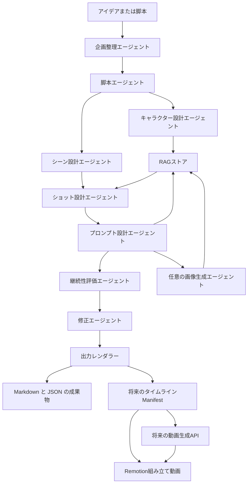

# アーキテクチャ

このアプリでは、Provider 経由のモデル呼び出し、エージェントごとの責務、型付きデータ契約、RAG メモリ、人間が読める成果物への出力を分離します。

動画生成APIを使えない段階では、生成済み画像、字幕、読み上げ音声を Remotion で組み立てる方針を取れます。将来的に動画生成APIを追加する場合も、`timeline_manifest.json` を境界にして、Remotion を最終編集・レンダリングレイヤーとして残す設計にします。詳しくは [remotion_video_assembly_plan.md](remotion_video_assembly_plan.md) を参照してください。
