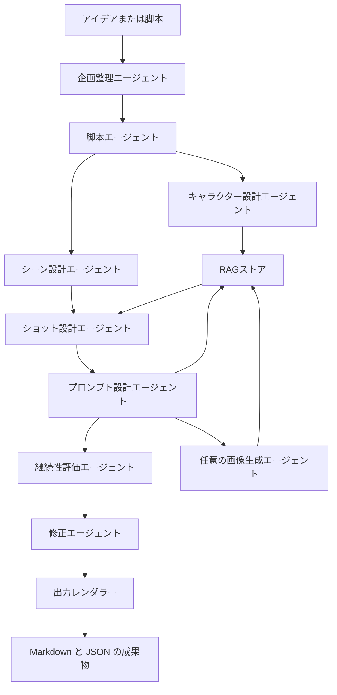

# アーキテクチャ

```mermaid
flowchart TD
  A[アイデアまたは脚本] --> B[企画整理エージェント]
  B --> C[脚本エージェント]
  C --> D[キャラクター設計エージェント]
  D --> E[RAGストア]
  C --> F[シーン設計エージェント]
  F --> G[ショット設計エージェント]
  E --> G
  G --> H[プロンプト設計エージェント]
  H --> E
  H --> I[継続性評価エージェント]
  I --> J[修正エージェント]
  J --> K[出力レンダラー]
  H --> L[任意の画像生成エージェント]
  L --> E
  K --> M[Markdown と JSON の成果物]
```

このアプリでは、Provider 経由のモデル呼び出し、エージェントごとの責務、型付きデータ契約、RAG メモリ、人間が読める成果物への出力を分離します。
