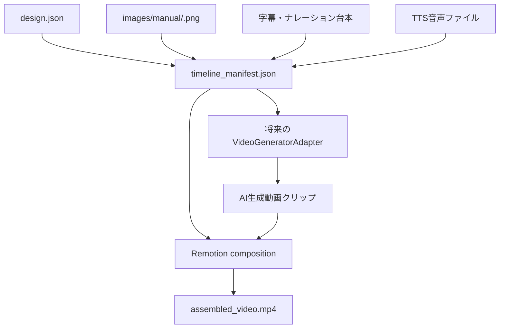

# Remotion による画像連結動画の実装計画

このドキュメントは、動画生成 API を使わずに、生成済みショット画像をつなげて、字幕と読み上げ音声つきの動画を作るための計画です。

将来的に Veo、Runway、Pika、Luma などの動画生成 API を追加しても置き換えやすいように、Remotion は「動画生成」ではなく「動画編集・合成レイヤー」として扱います。

## 結論

可能です。

現在の ViMax Lite には、すでに次の素材があります。

- `design.json`
- `storyboard.md`
- `video_prompts.md`
- `images/manual/<shot_id>.png`
- ショットごとの説明、カメラ、照明、音、first frame、last frame

これらを使えば、AI動画生成APIがなくても次のような動画を作れます。

- 生成済み画像をショット順につなげる。
- 画像にゆるいズーム、パン、フェードを付ける。
- ショット説明や台詞を字幕として重ねる。
- 読み上げ音声を付ける。
- BGMや効果音を後から追加する。
- MP4として書き出す。

これは厳密には「AI動画生成」ではなく、「画像ベースの自動動画編集」です。ただし、ポートフォリオとしてはかなり強い派生です。なぜなら、制作設計、画像生成、字幕、音声、動画編集、将来の動画生成APIまでを一つのパイプラインとして説明できるからです。

## Remotion を使う理由

Remotion は React コンポーネントで動画を記述し、CLI やサーバーサイド API で MP4 などにレンダリングできるフレームワークです。

ViMax Lite との相性が良い理由は次の通りです。

- `design.json` を props として渡しやすい。
- ショット単位の画像、字幕、音声を React コンポーネントとして管理できる。
- 画像には Remotion の `` を使える。
- 音声には `<Html5Audio>` を使える。
- ショットを順番につなぐには `<Series>` や `<Sequence>` を使える。
- ローカル CLI で `npx remotion render` による動画書き出しができる。
- 将来は Remotion Lambda や Cloud Run でサーバーサイドレンダリングにも拡張できる。

## 役割分担

ViMax Lite の中では、動画まわりを次の3層に分けます。

```text
1. Shot Design Layer
   Python / Gemini / RAG
   ショット設計、画像プロンプト、動画プロンプト、字幕案、ナレーション案を作る。

2. Media Asset Layer
   Python / Web UI
   画像、音声、字幕、BGM、manifest を保存する。

3. Video Output Layer
   Remotion / future video generation API
   画像連結動画、または本物の動画生成クリップを作る。
```

重要なのは、Remotion を「最後の出力方式の一つ」として扱うことです。これにより、将来動画生成 API を追加しても、既存の設計を捨てずに済みます。

## 推奨アーキテクチャ



## 新しく追加したい成果物

```text
outputs/<project>/
  timeline_manifest.json
  narration_script.md
  subtitles.srt
  audio/
    narration.wav
    narration_manifest.json
  videos/
    assembled_video.mp4
    render_report.md
```

### `timeline_manifest.json`

Remotion や将来の動画生成APIが読む共通仕様です。

例:

```json
{
  "project": "portfolio-demo",
  "fps": 30,
  "width": 1920,
  "height": 1080,
  "shots": [
    {
      "shot_id": "shot_001",
      "image_path": "images/manual/shot_001.png",
      "duration_seconds": 4.0,
      "caption": "雨の東京路地に、孤独な配達ロボットが立ち止まる。",
      "narration": "雨の音だけが響く路地で、小さな配達ロボットは初めて音楽を聞いた。",
      "motion": {
        "type": "slow_zoom_in",
        "strength": 0.06
      },
      "transition": {
        "type": "crossfade",
        "duration_seconds": 0.5
      }
    }
  ]
}
```

## CLI の拡張案

```bash
vimax-lite idea2design --project portfolio-demo --idea "..." --output-mode remotion
vimax-lite timeline --project portfolio-demo
vimax-lite narrate --project portfolio-demo --provider mock
vimax-lite tts --project portfolio-demo --provider local
vimax-lite render-video --project portfolio-demo --renderer remotion
```

### `--output-mode remotion`

制作設計の段階から Remotion 用に寄せるモードです。

通常モードでは、動画生成 API に渡すことを想定して first frame、last frame、時間変化、カメラ移動を細かく設計します。

Remotion モードでは、生成済み静止画をつなげる前提になるため、次のように設計を変えます。

- 1ショット1枚絵として意味が伝わる構図にする。
- 字幕やナレーションに変換しやすい短い出来事単位で脚本を作る。
- `motion` は slow zoom、slow pan、hold、crossfade など Remotion で再現しやすい動きに寄せる。
- `audio` には読み上げナレーション、環境音、短い効果音の方針を含める。
- `video_prompts` は動画生成 API 用ではなく、Remotion の編集指示、字幕候補、ナレーション候補、ショット秒数の意図が分かる内容にする。

Web UI では「出力モード」から選択できます。

### `timeline`

`design.json`、`image_manifest.json`、`reference_plan.json` から `timeline_manifest.json` を作ります。

責務:

- ショット順を確定する。
- 各ショットの画像パスを解決する。
- 画像がないショットを `missing` として記録する。
- 秒数、fps、解像度、トランジションを決める。

### `narrate`

ショット説明から字幕とナレーション台本を作ります。

責務:

- 字幕用の短い文を作る。
- 読み上げ用の自然な台本を作る。
- `narration_script.md` と `timeline_manifest.json` を更新する。

### `tts`

ナレーション台本から音声を作ります。

候補:

- ローカルまたは無料枠の TTS。
- OS の読み上げ機能を使う簡易方式。
- 将来的には ElevenLabs、Google Cloud TTS、OpenAI TTS などに差し替え可能。

最初は `TTSProvider` 抽象を作り、`mock` provider では無音音声またはダミー音声を生成できるようにします。

### `render-video`

Remotion プロジェクトを使って MP4 を作ります。

責務:

- `timeline_manifest.json` を Remotion に渡す。
- 画像を順番に表示する。
- 字幕を焼き込む。
- 音声を重ねる。
- `videos/assembled_video.mp4` を出力する。

## Web UI の拡張案

プロジェクト画面に「動画組み立て」タブを追加します。

表示するもの:

- 画像が揃っているショット数。
- 未生成画像の一覧。
- 字幕プレビュー。
- ナレーション台本。
- 音声生成状態。
- Remotion レンダリング状態。
- 完成動画のプレビューとダウンロード導線。

操作:

- タイムライン生成。
- 字幕/ナレーション生成。
- 音声生成。
- 動画レンダリング。

## Remotion 側の構成案

```text
remotion/
  package.json
  src/
    index.ts
    Root.tsx
    VimaxTimelineVideo.tsx
    ShotScene.tsx
    Captions.tsx
```

### `VimaxTimelineVideo.tsx`

- `timeline_manifest.json` を props として受け取る。
- `<Series>` でショットを順番に並べる。
- 各ショットに `ShotScene` を割り当てる。
- 音声ファイルがある場合は `<Html5Audio>` で再生する。

### `ShotScene.tsx`

- `` でショット画像を表示する。
- ゆるいズーム、パン、フェードを付ける。
- 字幕を画面下部に表示する。

### `Captions.tsx`

- 字幕の表示位置、背景、文字サイズ、改行を管理する。
- 将来的には SRT 読み込みや animated captions に拡張する。

## 将来の動画生成 API との接続

Remotion 実装と本物の動画生成APIを両立するため、次の抽象を用意します。

```python
class VideoOutputProvider:
    def render(self, timeline: TimelineManifest, paths: ProjectPaths) -> VideoRenderResult:
        ...
```

実装候補:

```text
RemotionVideoRenderer
  画像 + 字幕 + 音声を編集動画として出力する。

VeoVideoGenerator
  各ショットの first frame / last frame / prompt からAI動画クリップを生成する。

RunwayVideoGenerator
  Runway APIでショット動画を生成する。

PikaVideoGenerator
  Pika APIでショット動画を生成する。

LumaVideoGenerator
  Luma APIでショット動画を生成する。
```

将来の理想形:

```text
1. 画像がある場合:
   Remotionで即座に仮動画を作る。

2. 動画生成APIが使える場合:
   各ショットをAI動画クリップ化する。

3. 最終出力:
   AI動画クリップ、字幕、音声、BGMをRemotionで組み立てる。
```

つまり、Remotion は将来不要になるものではありません。むしろ、AI動画クリップを結合し、字幕や音声を重ねる最終編集レイヤーとして残ります。

## 実装フェーズ

### Phase A: 設計のみ

- このドキュメントを追加する。
- `timeline_manifest.json` の仕様を固める。
- 学習ロードマップに動画組み立てフェーズを追加する。

### Phase B: Remotion なしの Python プレビュー

- `timeline` コマンドを追加する。
- 画像の不足チェックをする。
- 字幕とナレーション台本を生成する。

### Phase C: Remotion 導入

- `remotion/` ディレクトリを追加する。
- `timeline_manifest.json` を props として読む。
- 画像を `<Series>` でつなげる。
- 字幕を焼き込む。
- `npx remotion render` で MP4 を出力する。

### Phase D: TTS 導入

- `TTSProvider` を追加する。
- `mock` では無音音声を作る。
- 実 provider は後から追加する。
- `subtitles.srt` も出力する。

### Phase E: 動画生成API対応

- `VideoGenerationProvider` を追加する。
- ショット単位でAI動画クリップを生成する。
- 生成クリップを Remotion の入力にする。

## 学習ポイント

この拡張で学べること:

- タイムライン設計
- 画像、音声、字幕のメディアアセット管理
- Python と Node.js の連携
- JSON manifest を境界にした疎結合設計
- TTS provider 抽象
- 動画生成 provider 抽象
- Remotion による programmatic video rendering
- 将来の動画生成APIを見据えたアーキテクチャ設計

## 注意点

- Remotion は動画生成AIではなく、プログラムで動画を編集・レンダリングするツールです。
- 画像をつなげる動画なので、キャラクターが本当に動くわけではありません。
- ただし、ズーム、パン、フェード、字幕、音声を入れるだけで、ポートフォリオ用の完成動画として見せやすくなります。
- Windows でも動かせますが、Node.js、npm、Remotion、レンダリング環境のセットアップが必要です。
- WSL でレンダリングする場合は、Chrome/Chromium やフォント、依存ライブラリの確認が必要になる可能性があります。

## 参照

- [Remotion Getting started](https://www.remotion.dev/docs/)
- [Remotion Render your video](https://www.remotion.dev/docs/render)
- [Remotion ``](https://www.remotion.dev/docs/img)
- [Remotion `<Html5Audio>`](https://www.remotion.dev/docs/audio)
- [Remotion `<Sequence>`](https://www.remotion.dev/docs/sequence)
- [Remotion `<Series>`](https://www.remotion.dev/docs/series)
- [Remotion Captions](https://www.remotion.dev/docs/captions)
